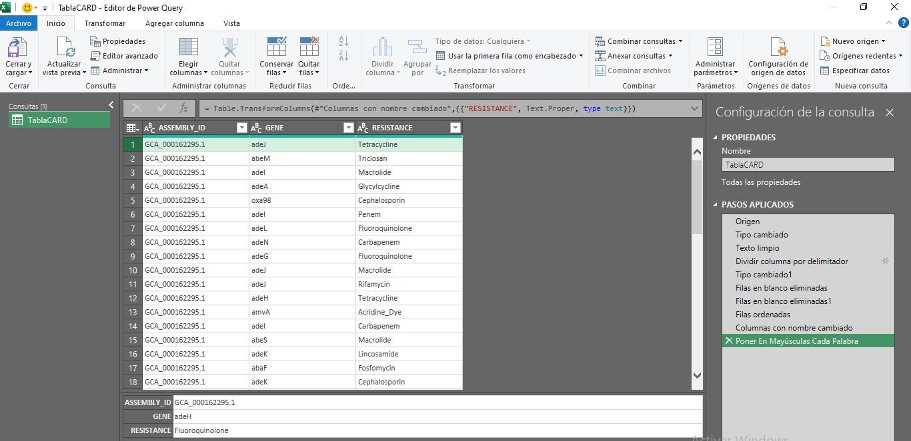
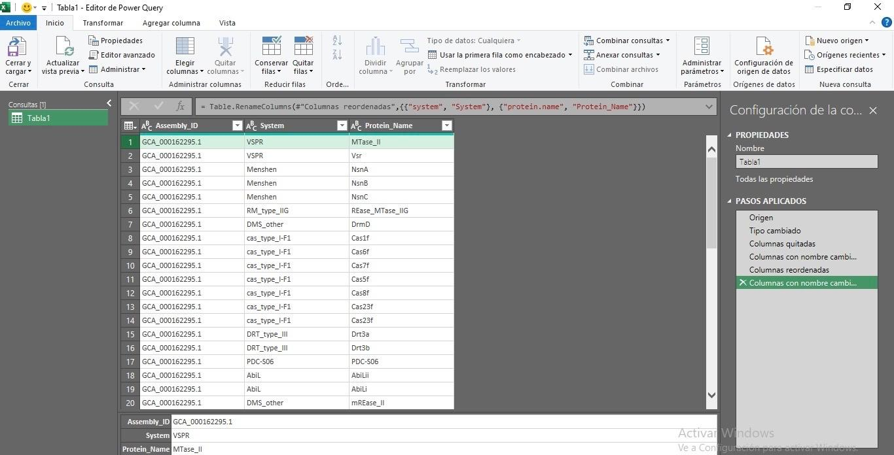
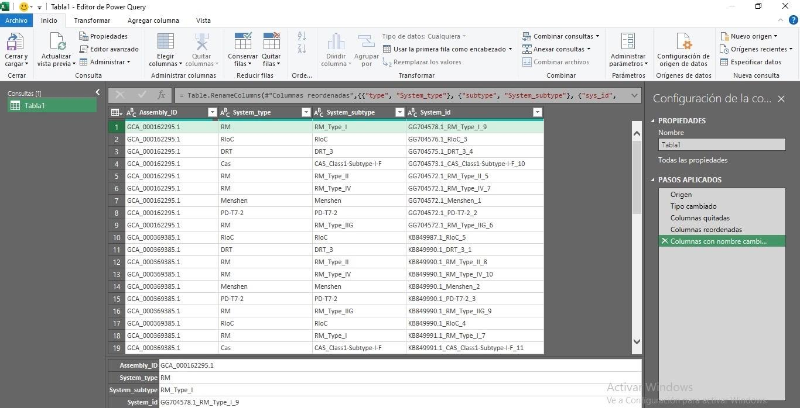
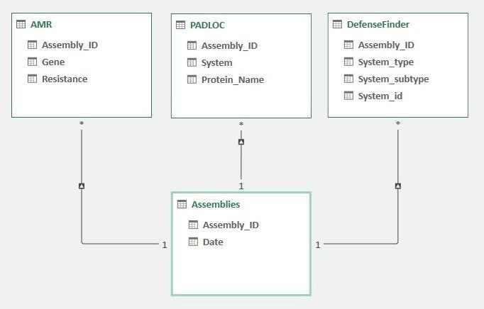
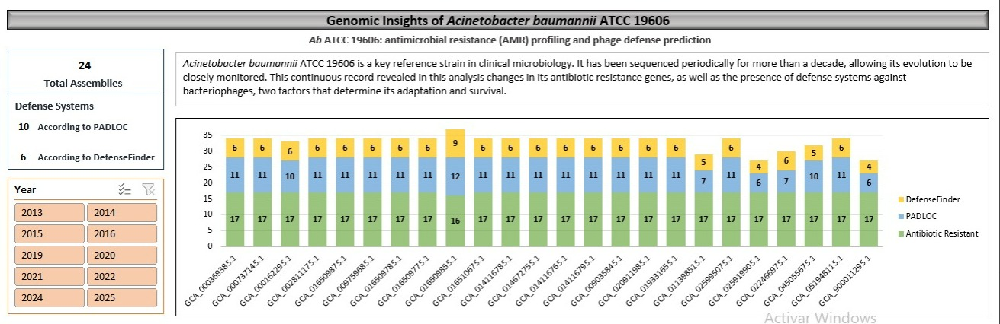

# AbATCC19606_AMR_DefenseSystems

This repository contains a reproducible workflow to download *Acinetobacter baumannii* ATCC 19606 genomes from NCBI, annotate antimicrobial resistance genes using ABRicate (with the CARD database), and predict anti-phage defense systems with PADLOC and DefenseFinder.

## Download Genomes of *Acinetobacter baumannii* ATCC 19606

This section describes how to download genomic sequences of *Acinetobacter baumannii* ATCC 19606 from NCBI GenBank. The workflow uses Linux command-line tools and is reproducible.

```bash
# 1. Create a directory for the genome sequences
mkdir AbATCC19606_Sequences
cd AbATCC19606_Sequences

# 2. Download the GenBank assembly summary file
wget https://ftp.ncbi.nlm.nih.gov/genomes/genbank/assembly_summary_genbank.txt

# 3. Filter the table for Acinetobacter baumannii ATCC 19606 assemblies
cat assembly_summary_genbank.txt | grep "Acinetobacter" | grep "baumannii" | grep "ATCC" | grep "19606" > AbATCC19606_assembly_summary_genbank.tsv

# 4. (Optional) Clean and transform the file manually if needed

# 5. Generate the URLs of genomic FASTA files
awk -F'\t' 'NR>1 && $9!="" {split($9,a,"/"); base=a[length(a)]; print $9 "/" base "_genomic.fna.gz"}' AbATCC19606_assembly_summary_genbank.tsv > AbATCC19606_genomes_urls.txt

# 6. Download the genome FASTA files
wget -i AbATCC19606_genomes_urls.txt

# 7. Decompress the downloaded FASTA files
gzip -d *.fna.gz
```

## Detect antimicrobial resistance genes

This step identifies antimicrobial resistance (AMR) genes in the genomes using **ABRicate** with the **CARD** database.

```bash
# Create directory for results
mkdir -p Antimicrobial_resistance_genes

# Run ABRicate on all genome sequences
for f in ./AbATCC19606_Sequences/*.fna; do
    base=$(basename "$f" .fna)
    for db in card; do
        abricate --db $db "$f" > "Antimicrobial_resistance_genes/${base}_${db}.tab"
    done
done

# Merge .tab files
cat *.tab > Results_AbATCC19606_CARD.tab
```

### Process AMR results in Power Query

The raw output obtained from ABRicate was processed using **Power Query** in Excel to prepare a clean table for downstream analysis.

#### Steps performed
1. Imported the `.tab` file generated by ABRicate into Power Query.
2. Split columns by delimiter
3. Removed unnecessary columns (for this study).
4. Applied text cleaning (capitalization, standardization of names).
 
Below is an example of the processed table in Power Query:



## Detect phage defense systems

### Using PADLOC

```bash
# Create directory for results
mkdir -p PADLOC_results

# Run PADLOC on all assemblies
for f in ./AbATCC19606_Sequences/*.fna; do
    base=$(basename "$f" .fna)
    padloc --fna "$f" --outdir PADLOC_results/${base}_padloc_results
done

# Merge .csv files
cat *.csv > Results_AbATCC19606_PADLOC.csv
```

### Process PADLOC results

The raw output obtained from PADLOC was first pre-processed and then refined using **Power Query** in Excel.

---

#### Pre-process PADLOC output  

The original PADLOC output files (`*_padloc.csv`) were modified to include the corresponding **Assembly_ID** in each row and then merged into a single table.  

**Steps performed**  
1. Extracted the Assembly accession (`GCA_xxxxxxx.x`) from the filename.  
2. Appended the accession as a new column to each row of the PADLOC output.  
3. Saved the modified files as `mod_*_padloc.csv`.  
4. Merged all modified files into a single table `Salida_PADLOC.csv`.  

```bash
for file in *_padloc.csv; do
    gca=$(basename "$file" | grep -oE 'GCA_[0-9]+\.[0-9]+' || true)
    out="mod_${file}"
    { printf "%s,GCA\n" "$(head -n1 "$file")"; tail -n +2 "$file" | sed "s/\$/,$gca/"; } > "$out"
    echo "Generado: $out"
done

awk 'FNR==1 && NR!=1{next} {print}' mod_*_padloc.csv > Results_AbATCC19606_PADLOC.csv
```

### Process PADLOC results in Power Query

The raw output obtained from PADLOC was processed using **Power Query** in Excel to prepare a clean table for downstream analysis.

#### Steps performed
1. Imported the .csv file generated by PADLOC into Power Query.
2. Changed data types for consistency.
3. Removed unnecessary columns (for this analysis).
4. Renamed columns for clarity.
5. Reordered columns for readability.

Below is an example of the processed table in Power Query:



### Using DefenseFinder

```bash
mkdir DefenseFinder_results
for genome in *.fna; do
    echo "Procesando $genome..."
    defense-finder run "$genome" --out-dir "DefenseFinder_results/${genome%.fna}_defense"
done

# Merge .tsv files
cat *.tsv > Results_AbATCC19606_DefenseFinder.tsv
```

### Process DefenseFinder results

The raw output obtained from DefenseFinder was first pre-processed and then refined using **Power Query** in Excel.

---

#### Pre-process DefenseFinder output  

The original DefenseFinder output files (`*_genomic_defense_finder_systems.tsv`) were modified to include the corresponding **Assembly_ID** in each row and then merged into a single table.  

**Steps performed**  
1. Extracted the Assembly accession (`GCA_xxxxxxx.x`) from the filename.  
2. Appended the accession as a new column to each row of the DefenseFinder output.  
3. Saved the modified files as `mod_*_genomic_defense_finder_systems.tsv`.  
4. Merged all modified files into a single table `Salida_DefenseFinder.tsv`.  

```bash
for file in *_genomic_defense_finder_systems.tsv; do
    gca=$(basename "$file" | grep -oE 'GCA_[0-9]+\.[0-9]+' || true)
    out="mod_${file}"
    { printf "%s\tGCA\n" "$(head -n1 "$file")"; tail -n +2 "$file" | sed "s/\$/\t$gca/"; } > "$out"
    echo "Generado: $out"
done

awk 'FNR==1 && NR!=1{next} {print}' mod_*_genomic_defense_finder_systems.tsv > Salida_DefenseFinder.tsv
```

### Process DefenseFinder results in Power Query

The raw output obtained from DefenseFinder was processed using **Power Query** in Excel to prepare a clean table for downstream analysis.

#### Steps performed
1. Imported the .tsv file into Power Query.
2. Removed unnecessary columns.
3. Renamed selected columns for clarity.
4. Reordered the columns for consistency.
5. Kept only the most relevant information for this study.

Below is an example of the processed table in Power Query:



## Relational Model & Dashboard

The processed outputs from AMR, PADLOC, and DefenseFinder were integrated into a relational model using Power Pivot in Excel.
This relational structure allowed consistent analysis across assemblies, linking antimicrobial resistance genes and phage defense systems.

### Relational Model:



### Dashboard:



The dashboard provides:
- Total assemblies analyzed.
- Number of defense systems detected according to PADLOC and DefenseFinder.
- Year distribution of assemblies.
- Comparative stacked barplot of AMR genes and phage defense systems per assembly.
